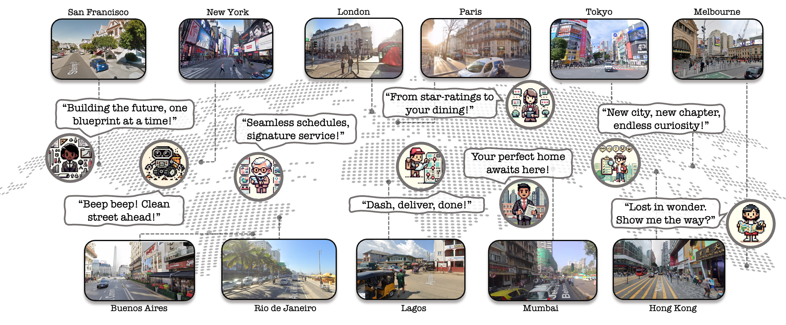

<div align="center" style="font-family: charter;">

<h1><i>V-IRL</i>: Grounding Virtual Intelligence in Real Life</h1>

<!-- <p>tl;dr: We build a platform that enables agents to scalably interact with the real-world in a virtual yet realistic environment.</p> -->
<div>
    <a href="https://jihanyang.github.io/" target="_blank">Jihan Yang</a><sup>1</sup>,</span>
    <a href="https://dingry.github.io/" target="_blank">Runyu Ding</a><sup>1</sup>,</span>
    <a href="https://ellisbrown.github.io/" target="_blank">Ellis Brown</a><sup>2</sup>,</span>
    <a href="https://xjqi.github.io/" target="_blank">Xiaojuan Qi</a><sup>1</sup>,</span>  
    <a href="https://www.sainingxie.com/" target="_blank">Saining Xie</a><sup>2</sup>,</span>
</div>

<div>
    <sup>1</sup>The University of Hong Kong&emsp;
    <sup>2</sup>New York University
</div>

[project page](https://virl-platform.github.io) | [arXiv](https://arxiv.org/abs/2402.03310)



</div>

****

### Changelog
- [2024-04-18] **NEW!!** Release code for benchmark along with installation & curation & evaluation guideline.

- [2024-04-09] **NEW!!** Release code for agents and installation & deployment & running guideline.

- [2024-02-06] Release basic platform code.

### Release Checklist
- [x] Basic Platform Code 
- [x] Agents
  - [x] Peng
  - [x] Aria
  - [x] Vivek
  - [x] RX-399
  - [x] Imani
  - [x] Hiro
  - [x] Ling
  - [x] Local
  - [x] Diego
- [x] Benchmarks
- [x] Install & Deployment guideline
- [ ] Platform Document


### Installation
Please refer to [INSTALL.md](./docs/INSTALL.md) for installation of `V-IRL`


### Getting Started
Please refer to [GETTING_STARTED.md](./docs/GETTING_STARTED.md) to learn more usage about this project.


### FQA
Please refer to [FQA.md](./docs/FQA.md) to learn solution for some potential issues.


### Citation
If you find this project useful in your research, please consider cite:
```
@inproceedings{yang2024virl,
  title={V-irl: Grounding virtual intelligence in real life},
  author={Yang, Jihan and Ding, Runyu and Brown, Ellis and Qi, Xiaojuan and Xie, Saining},
  booktitle={European conference on computer vision},
  year={2024}
}
```


